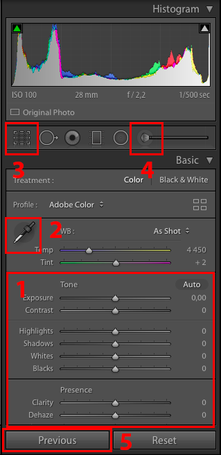
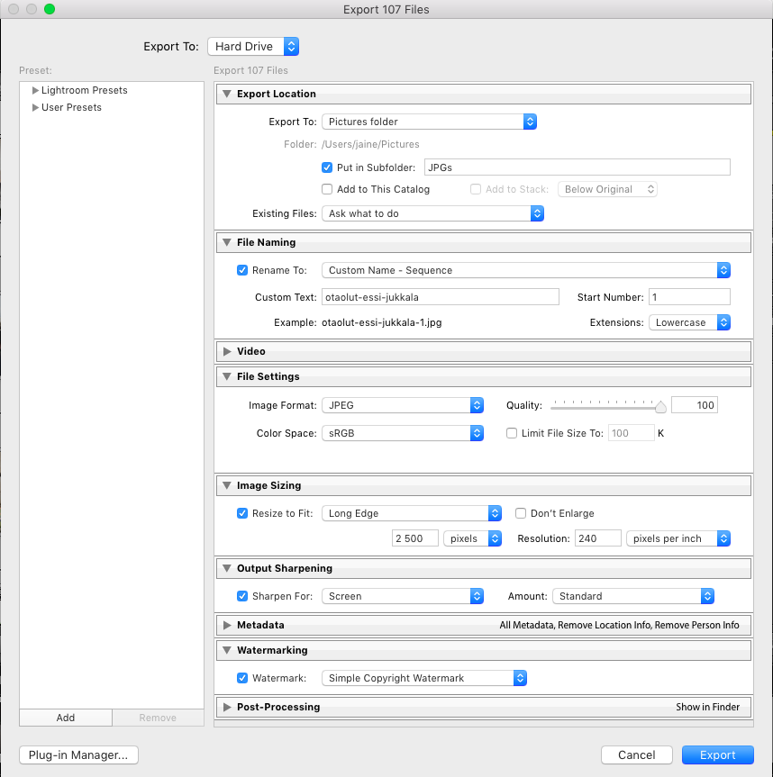

# Ohjeet SIKin valokuvaajille kuvien editointiin

Tämän dokumentin tarkoitus on yrittää vastata ainakin seuraaviin kysymyksiin:

1. Miten valita helposti suuresta määrästä kuvia onnistuneet ja laittaa eteenpäin käsittelyyn?
2. Miten käsitellä kuvat näyttämään hyviltä yleisesti?
3. Miten tehdä käsittely yksittäiselle kuvalle tehokkaasti?
4. Miten käsitellä suuri määrä erilaisia kuvia tehokkaasti?
5. Miten exportata suuri määrä kuvia killan galleriaan sopivaan kokoon?
6. Miten nimetään helposti uudelleen suuri määrä tiedostoja?
7. Miten kuvat ladataan killan galleriaan?

# Sisältö

- [Lightroomista](#lightroom)
- [Kuvien tuominen koneelle](#kuvien-tuominen-koneelle)
    - [Ensimmäisen kerran asetukset](#ensimmäisen-kerran-asetukset)
- [Kuvien valitseminen](#kuvien-valitseminen)
- [Kuvien editointi](#kuvien-editointi)
- [Kuvien exporttaus](#kuvien-exporttaus)
- [Kuvien lisääminen killan galleriaan](#kuvien-lisääminen-killan-galleriaan)

## Kuvien ottaminen
- Otathan kuvat raakadatana (RAW)
    - Tällöin valotusta voi säätää helposti jälkikäteen, joten ei haittaa, vaikka kuvat olisivat hieman yli- tai alivalottuneita
- Ethän ota sataa kuvaa yhdestä tilanteesta, muutama kuva riittää

## Lightroom

Itse käytän, ja suosittelen myös muille, Adoben Lightroom Classic -sovellusta suurien kuvamäärien käsittelyyn. Sovelluksen saa itselleen opiskelijajäsenenä hintaan 20,15 €/kk ensimmäiseksi vuodeksi ja 30,99 €/kk sen jälkeen (tarkistettu 20.8.2023). Oikea versio Lightroomista on nykyään nimeltään Lightroom Classic, ei pelkkä Lightroom.

Seuraavat ohjeet on tehty Lightroom Classicille. Sovelluksen ulkoasu voi vaihdella eri versioiden välillä, mutta toiminnot ovat samat.

## Kuvien tuominen koneelle

Kuvat tuodaan Lightroomiin kamerasta (tai kovalevyltä) valitsemalla valikosta `File > Import Photos and Video`.

Alla olevassa kuvassa (kohta numero 1) valitaan, mistä kuvia tuodaan (yleensä esim. kamera).

### Ensimmäisen kerran asetukset 

Ennen ensimmäistä kuvien tuontia Lightroomiin kannattaa asetukset importille laittaa kuntoon.

Ensimmäinen valinta on ikkunan keskellä oleva valinta `Copy as DNG / Copy / Move / Add` (numero 2). Näistä suosin itse valintaa `Copy`, jolloin kuvat kopioidaan kamerasta kovalevylle. Valinnoista `All Photos / New Photos / Destination Folders` (numero 3) olen pitänyt valintana aina `All Photos`, jotta epähuomiossa jokin kuva ei jäisi tuomatta koneelle muistikortilta. Lisää tästä myös alla.

Oikeassa yläkulmassa on määritelty kuvien tallennuspaikka (numero 4, esim. oma `My Pictures` kansiosi). Suosin itse tämän käyttöä, sillä  Lightroom osaa lajitella kuvat vuosiluvuittain kansioihin ja edelleen päivämäärän mukaan alikansioihin. Oikeasta reunasta löytyvästä `Destination`-valikosta (numero 5) voit tarkastella tarkemmin kuvien jakautumista kansioihin. Samassa valikossa voit myös valita päivämäärän formaatin.

Oikeasta reunasta löytyvästä valikosta `File Handling` (numero 6) voit valita ainakin, ettei jo aiemmin importattuja kuvia tuoda uudestaan (`Don't Import Suspected Duplicates`) ja myös kopioida kuvat esim. kahteen paikkaan backupeja varten (`Make a Second Copy To:`).

## Kuvien valitseminen

Kun kuvat on tuotu koneelle, löytyvät ne vasemmalta `Catalog`-valikosta, kohdasta `Previous Import`. Vaihtoehtoisesti voit etsiä oikean kansion vasemmalta `Folders`-valikosta (alla oleva kuva, kohta numero 1).

Kuvien käyminen läpi kannattaa tehdä `Develop`-näkymässä `Library`-näkymän sijaan (kohta numero 2). Develop-näkymässä voit nopeasti vertailla peräkkäisiä kuvia ja säätää niitä tarvittaessa jo läpikäyntivaiheessa, jotta voit arvioida helposti, mitkä kuvat pääsevät "jatkoon".

Develop-näkymässä näät yhden kuvan kerrallaan, ja voit siirtyä kuvien välillä nuolinäppäimillä. Painamalla B:tä valitset kuvan Quick Collectioniin, joka on helppo tapa valita tuoduista kuvista editoitavat kuvat.

Kun kuvat on valittu, siirrytään `Library`-näkymässä kohdasta `Previous Import` kohtaan `Quick Collection`, josta löytyvät nyt editointiin valitut kuvat.

## Kuvien editointi

### Yleistä

Valittujen kuvien editointi on helppoa `Develop`-näkymässä. Kuvat on helppo käydä läpi yksi kerrallaan ja käyttää hyväksi samasta tilanteesta otettujen kuvien kanssa samoja asetuksia. Samalla on mahdollista hienosäätää jokaisen kuvan asetuksia yksittäin, jolloin jokaisesta kuvasta laadukkaan ja mietityn näköinen.

### Editointi

Kuvien editointi kannattaa aloittaa ensimmäisestä kuvasta, säätäen ensin kohdalleen valkotasapaino automaattivalitsimella (alla oleva kuva, kohta numero 2). Myös manuaalinen säätö tai kuvan jättäminen kuvattuun valkotasapainoon voivat olla tilanteesta riippuen hyvä idea. 

Tämän jälkeen säädetään kuvan valot ja varjot sekä värit kuntoon liukuvalitsimilla (kohta 1).

Kuvien rajaus ja kääntö onnistuu samasta valikosta löytyvällä valitsimella (kohta 3).

Kuvien hienosäätöön myös `Adjustment Brush` (kohta 4) on hyödyllinen, sillä sen avulla voi maalata kuvan osia ja muokata vain niiden asetuksia.

Kun ensimmäinen kuva on saatu valmiiksi, siirrytään esim. nuolinäppäimillä seuraavaan kuvaan ja tuodaan edellisen kuvan asetukset painamalla `Previous` (kohta 5), joka tuo edellisen valitun kuvan asetukset nykyisen kuvan asetuksiksi.

Käyttämällä edellisen kuvan asetuksia pohjana seuraavan kuvan muokkaaminen on yleensä helppoa, ja asetukset voi tuoda myös jostakin muusta kuvasta valitsemalla sen ensin ja sen jälkeen valitsemlla muokattavan kuvan ja painamalla `Previous`. Asetukset voi myös synkronoida suoraan useampaan kuvaan valitsemalla useita kuvia, jolloin `Previous` muuttuu `Sync`-nappulaksi, mutta yleensä `Previous`-nappia käyttämällä ja yksittäin kuvat läpi käymällä tulee parempaa jälkeä nopeammin.

## Kuvien exporttaus

Valitse kuvat ja valitse `File > Export`.

`Export`-valikossa on seuraavat kohdat joihin kannattaa kiinnittää huomioita: `Export Location`, `File Naming`, `File Settings`, `Image Sizing`, `Output Sharpening` ja `Watermarking`.

`Export Location`-kohdassa valitaan, mihin valmiit kuvat tallennetaan. Yksi järkevä tapa arkistoida editoidut kuvat on esimerkiksi alikansioon importattujen kuvien kanssa. Tämä onnistuu `Put in subfolder`-valinnalla suoraan.

`File Naming`-kohdassa voit nimetä kuvat helposti. Valitsemalla `Custom Name - Sequence` voit lisätä `Custom Text`-kenttään helposti kuvan nimen tyylillä tapahtumannimi-kuvaajannimi-numero, mikä on suositeltu formaatti killan galleriaan kuvia lisättäessä. 

`File Settings`-kohdassa ainoa huomioitava asetus on `Quality`, joka on hyvä asettaa aina arvoon 100.

`Image Sizing`-kohdassa `Resize to Fit` kannattaa valita `Long Edge` ja laittaa raksi ruutuun `Don't enlarge`. Tämän lisäksi asetetaan arvo, johon kuvat skaalataan, esim. 2500px. 

`Output Sharpening`-kohdassa voi valita valinnan `Sharpen For: Screen`, sillä yleensä kuvat editoidaan killan galleriaa varten, jota katsellaan pääasiassa tietokoneen näytöltä.

`Watermarking`-kohdassa voit asettaa oman copyright-merkkisi kuvaan, jos niin haluat.

Tämän jälkeen paina Export ja kuvat exportataan alussa valitsemaasi kansioon.

## Kuvien lisääminen killan galleriaan

Pikaohjeet kuvien lisäämiseen killan galleriaan (sik.kuvat.fi):

Jos sinulla ei vielä ole tunnuksia killan galleriaan:
- Luo tunnus: www.kuvat.fi &rarr; oikea yläkulma &rarr; kirjaudu &rarr; luo tunnus
- Pyydä tunnuksesi lisäämistä esim. SIK valokuvaajat -TG-ryhmässä tai viestintämestarilta
- Pyydä tunnuksen lisääjää lisäämään sinut etusivun kuvaajalistaan

Kuvien lisääminen:
- Luo uusi alikansio galleriaan oikean vuoden kohdalle
- Lisää kuvasi alikansioon
- Halutessasi voit valita kansiolle mm. kansikuvan ja kirjoittaa kuvauksen kansion asetuksista

Ongelmatapauksissa killan gallerian kanssa kysy apua esim. SIK valokuvaajat -TG-ryhmässä, toimikuntasi puheenjohtajalta tai viestintämestarilta.
